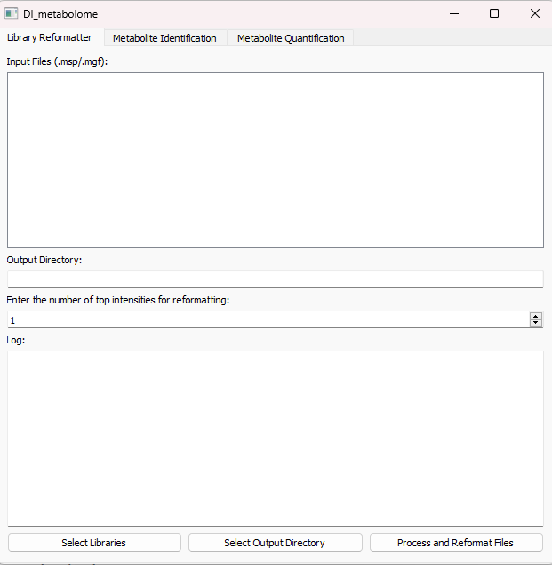
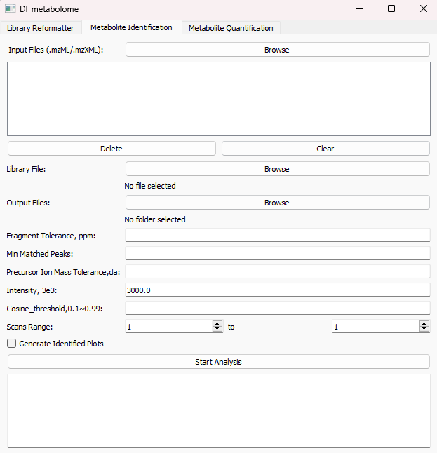

# DImeta

**DImeta** is developed for metabolites annotation and quantification from direct injection mass spectrometry. 

This software primarily consists of three modules: 
-   Library import and reformatting module
-   metabolies identification module
-   graphical user interface (GUI) module

Considering the varying file formats and data structures of library files from different database sources, we redesigned the library import and integration module. This module supports the reading of library files in both **.mgf** and **.msg** formats and allows simultaneous processing of multiple library files from different sources. The output file format is **.msp**, and the number of fragment ions in MS2 spectra of the output library is configurable.

Metabolite identification is based on the accurate matching of primary precursor ions and secondary fragment ions. Cosine similarity algorithm is used to compare and score the matches against MS2 spectra in input library. The input file format for identification should be **.mzML** or **.mzXML**. The parameters for the identification process include: 
-  Minimum matched fragments, 
-  Fragment ion intensity cutoff, 
-  Precursor ion Mass Tolerance, 
-  Fragment ion Mass Tolerance, 
-  Cosine score threshold, 
-  #Scan range
-  Generate plots for identified metabolites or not

Quantification is based on the intensity of strongest fragment ion from MS2 spectrum. For batch data identification, we can select a folder containing all identification results for quantification and alignment. The final results are exported as a .csv file, which includes all sample names, identified metabolites, and their corresponding quantifies.

